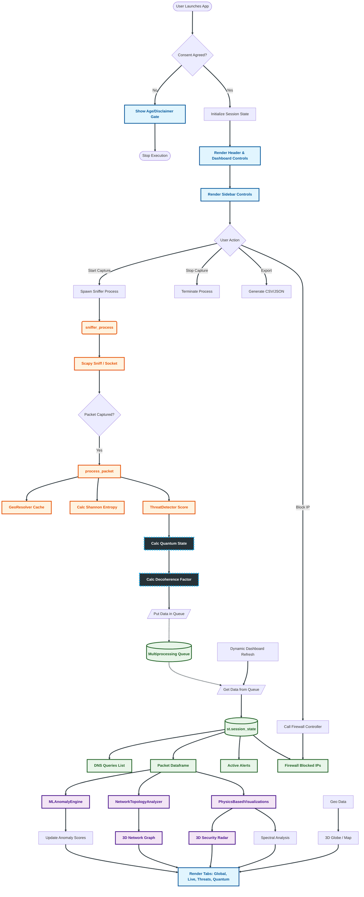

# <samp> CipherSky

<samp>
  
**CipherSky is a quantum‑enhanced defense HUD for real‑time traffic capture, anomaly detection, and active response. It combines IsolationForest ML, Shannon entropy, and YARA rules for threat scoring across ports, protocols, and geolocation. Coordinated attacks are modeled with quantum entanglement, visualized in a 3D Bloch Sphere and force‑directed particle simulations. A multiprocessing scapy sniffer, cross‑platform blocking (netsh/iptables), and WebGL dashboards (Streamlit, Plotly, PyDeck) deliver adaptive, high‑fidelity verdicts.**

<details>
   
**<summary>Project Details</summary>**

<details>
   
**<summary>CipherSky Preview</summary>**

</details>

<details>
   
**<summary>CipherSky Features</summary>**

* **Threat Detection : Utilizes `sklearn.ensemble.IsolationForest` to detect statistical outliers in traffic patterns. Calculates Shannon entropy on packet payloads to detect encrypted C2 channels or compressed malware exfiltration. Real-time threat scoring based on port reputation, protocol anomalies, and geographic consistency. Integrated YARA-style rule matching for detecting suspicious network strings and dark web activity.**
  
* **Quantum & Physics Analysis : Analyzes connection correlation using simulated quantum entanglement principles to detect coordinated attacks (botnets). 3D representation of the network's "Quantum State" (Coherence vs. Decoherence) based on entropy and threat levels. Force-directed 3D graph simulations where nodes act as particles with mass (data volume) and gravity (threat level).**
  
* **Active Defense & Forensics : Cross-platform blocking capabilities (Windows `netsh`, Linux `iptables`) directly from the UI. Single-click containment for high-risk IPs or subnets. Automated WHOIS, DNS resolution, and Reverse DNS lookups for forensic analysis. 3D interactive globe visualizing threat vectors and traffic sources using MaxMind GeoLite2.**
* **Performance Modes : Optimized for laptops. Reduces particle count and sampling rates. Balanced visual fidelity and analysis depth.Full physics simulations and deep packet inspection (Requires strong CPU).**
  
* **Visualizations : CipherSky standard charts, employing advanced mathematical models for visualization. Uses force-directed graph algorithms where nodes (IPs) repulse each other, but edges (connections) act as springs. Visualizes network health on a Bloch Sphere. High entropy/threats push the state vector towards decoherence.**

</details>

<details>
   
**<summary>Technical Details</summary>**


**CipherSky operates on a decoupled multi-process architecture to ensure the UI remains responsive while handling high-velocity packet capture.**

* **Sniffer Process (`multiprocessing`): A dedicated background process uses `scapy` to sniff raw sockets. It parses TCP/UDP/ICMP/DNS headers and computes immediate metrics (entropy, flags).**
  
* **Data Pipeline : Packets are prioritized based on threat score and pushed into a thread-safe `multiprocessing.Queue`.**
  
* **Analytics Engine : The main process retrieves packets, performs OSINT enrichment (with caching), runs ML inference, and updates the physics simulation state.**
  
* **Frontend : Streamlit renders the data using `Plotly` and `PyDeck` for WebGL-accelerated 3D visualizations.**


| Component      | Technology                  | Description                                                        | Data Flow Role                                      | Performance Notes                                                                 |
|----------------|-----------------------------|--------------------------------------------------------------------|-----------------------------------------------------|----------------------------------------------------------------------------------|
| Frontend       | Streamlit                   | Renders the reactive HUD and manages user interaction.              | Consumes analytics output and visual states.        | Lightweight UI; offloads heavy computation to backend; supports WebGL acceleration. |
| Packet Engine  | Scapy / Multiprocessing     | Captures and parses raw TCP/UDP/ICMP/DNS packets in a separate process. | Ingests raw traffic and pushes metrics into queue.  | Parallelized sniffing; isolates capture overhead; tuned for high‑velocity streams. |
| Visualization  | Plotly / PyDeck             | Renders WebGL 3D graphs, maps, and physics simulations.             | Maps analytics into interactive 3D topology views.  | GPU‑accelerated rendering; adaptive particle count for laptops vs. HPC setups.     |
| Analysis Core  | NumPy / NetworkX / Sklearn  | Computes entropy, graph centrality, and ML anomaly scores.          | Processes queued packets; enriches with OSINT/ML.   | Vectorized math; cached lookups; scalable anomaly detection via IsolationForest.   |
| Defense        | OS Subprocess               | Interfaces with system firewalls (netsh/iptables) for active blocking. | Executes containment and mitigation commands.       | Cross‑platform subprocess calls; minimal latency; integrates with forensic lookups.|

</details>

<details>


**<summary>Architecture</summary>** 



</details>
<details>


**<summary>Legal Disclaimer</summary>** 

```javascript

CipherSky is intended for defensive security analysis and educational purposes only. Ensure you have authorization before monitoring network traffic. The developers are not responsible for any misuse of this tool. Usage implies consent to local monitoring laws and regulations.
  
```
</details>

