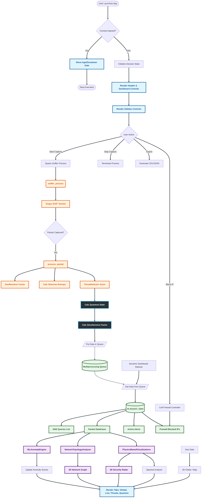

Here is a detailed Markdown Mermaid flowchart representing the architecture, data flow, and user interaction logic of the **CipherSky** application.

### **CipherSky Application Architecture**

This flowchart visualizes how the application utilizes **Streamlit** for the frontend and **Multiprocessing** for the backend packet sniffing, bridged by a thread-safe Queue.



-----

### **Flowchart Breakdown**

1.  **Initialization & Consent:**

      * The app begins by checking `ensure_user_consent`. If the user hasn't agreed to the T\&C and age verification, the app stops there.
      * Once agreed, `st.session_state` is initialized to hold data like `packet_data`, `blocked_ips`, and class instances (e.g., `ThreatDetector`).

2.  **The Backend (Sniffer Process):**

      * When **Start** is clicked, a separate `multiprocessing.Process` is spawned running `sniffer_process`.
      * 
      * It uses `scapy` to capture packets.
      * **Processing:** Every packet goes through `process_packet` where:
          * Geolocation is resolved (Cached).
          * Shannon Entropy is calculated (for encryption detection).
          * **Quantum Analysis:** Coherence and entanglement factors are calculated based on packet properties.
      * The processed dict is pushed into a `multiprocessing.Queue`.

3.  **The Data Bridge:**

      * The `Queue` acts as the thread-safe bridge. The background process *writes* to it, and the Streamlit frontend *reads* from it during every page rerun (refresh).

4.  **The Frontend (Streamlit UI):**

      * **Auto-Refresh:** The `DynamicDashboard` triggers reruns (e.g., every 2 seconds).
      * **Data Ingestion:** On every rerun, the app pulls packets from the Queue and appends them to `st.session_state.packet_data`.
      * **Firewall Controller:** Manage OS-level blocking (iptables/netsh) based on user interaction.

5.  **Visualization & Analytics:**

      * **Physics Engine:** Calculates node mass and force for the 3D particle simulation.
      * **Visualizations:**
        \*

[Image of 3D network topology]

```
    * **Global Intel:** 3D Globe with flight paths.
    * **Quantum:** Bloch sphere visualization of network states.
    * **Radar:** 3D Security and Performance metrics.
```
